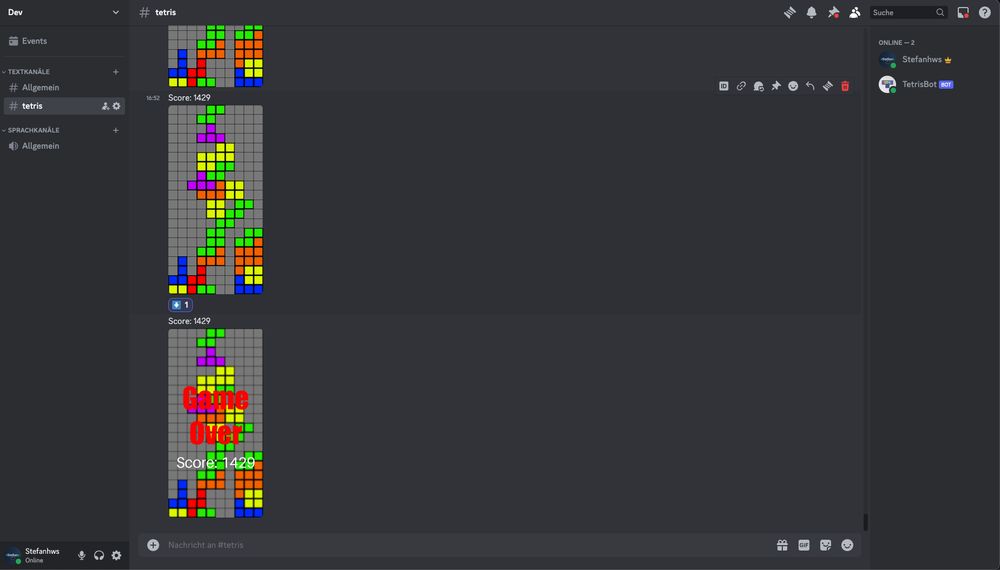
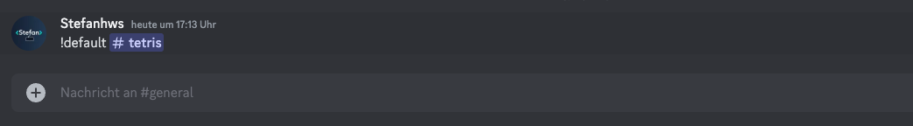
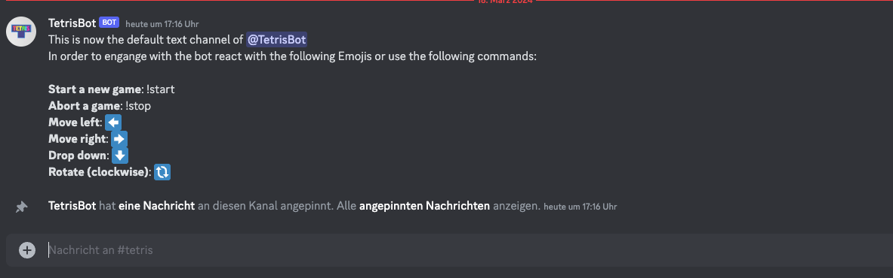

# Discord plays Tetris 
This discord bot lets your Discord community play Tetris. You can engage with the bot by reacting to its messages. 



## How to run
Head to the [Discord Developer Portal](https://discord.com/developers/applications) and create a new application. \
Copy the token and paste it in a file named discord_auth.json in the root directory:
```json
{"TOKEN": "<Your Token>"}
```
Now you need to install pillow, discord.py and emoji:
```shell
pip3 install pillow discord emoji
```
Then you can run
```
python3 src/TetrisBot.py
```

## Features
To play with friends you'll first have to set a default text-channel, that the bot can use:



Next the bot will pin a message with all the controls:



Once you start the game, you and your friends can start reacting to it's messages and play Tetris. Whichever emojiy has been used the most will decide how the game progresses. Have fun!

## Note
This used to be a bot for Twitter. You were able to influence the game by liking, commenting and retweeting. Unfortunately, due to the new strict Twitter API limitations, this is not possible anymore.